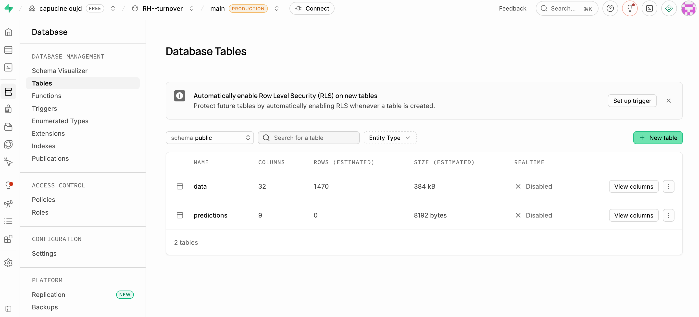
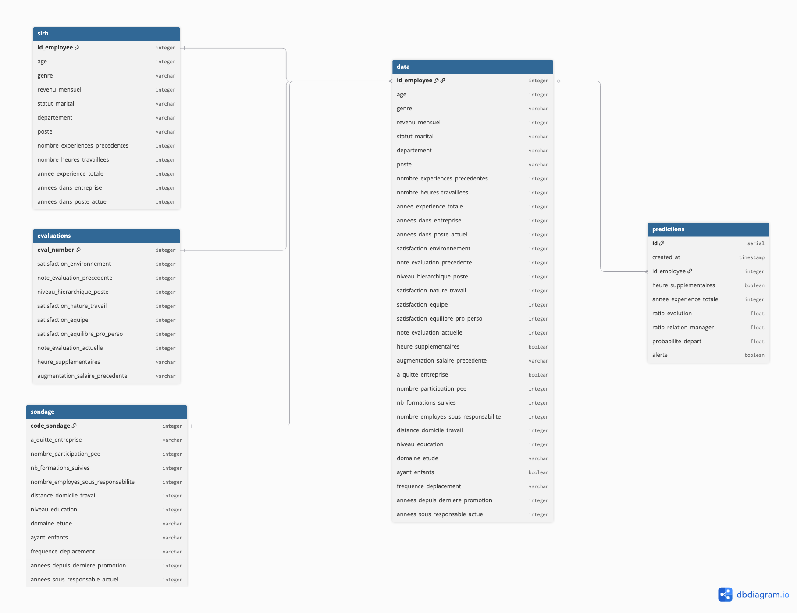

<div align="center">
  <h3 align="center">RH Turnover</h3>
  <p align="center">
    Prédiction du risque de départ volontaire des employés
  </p>
</div>

[](https://github.com/capucineloujd/rh--turnover/actions/workflows/ci-prod.yml)


**[Documentation complète](https://capucineloujd.github.io/rh--turnover/)** | **[API Swagger](https://rh-turnover.onrender.com/docs)**

<details>
  <summary>Table des matières</summary>
  <ol>
    <li><a href="#contexte-et-objectif">Contexte et objectif</a></li>
    <li><a href="#résultat-principal">Résultat pri
    <li><a href="#installation">Installation</a></li>
    <li><a href="#utilisation">Utilisation</a></li
    <li><a href="#déploiement">Déploiement</a></li>
    <li><a href="#cicd">CI/CD</a></li>
    <li><a href="#tests">Tests</a></li>
    <li><a href="#structure-du-projet">Structure d
    <li><a href="#contact">Contact</a></li>
  </ol>
</details>

## Contexte et objectif
Ce projet est le quatrième dans le cadre de ma formation IA d'OpenClassroom. Dans le cadre d'une problématique de turnover, nous analysons les données RH de l'entreprise pour identifier les causes de démission. Trois sources de données sont disponibles : le SIRH (profil et informations contractuelles des employés), le système d'évaluation annuelle (notes de performance et satisfaction), et un sondage bien-être annuel (incluant un indicateur de départ).

## Résultat principal
Le principal facteur de démission identifié est les heures supplémentaires. Le modèle final (CatBoost) atteint un recall de 0.766 sur le jeu de test avec un seuil de décision de 0.535.

## Built with

[](https://www.python.org/)
[](https://fastapi.tiangolo.com/)
[](https://catboost.ai/)
[](https://www.postgresql.org/)
[](https://www.docker.com/)
[](https://render.com/)
[](https://supabase.com/)
[](https://github.com/astral-sh/uv)

## Approche ML
Le dataset est issu d'une base de données privée pour une entreprise fictive. CatBoost a été retenu pour son bon compromis précision/recall sur ce jeu de données déséquilibré. La métrique principale est le recall : dans ce contexte, rater un départ (faux négatif) est plus coûteux que signaler à tort un employé qui reste. Le seuil de décision a été ajusté à 0.535 pour maximiser le recall tout en maintenant une précision acceptable. Un `random_state` fixe est utilisé dans tous les modules pour garantir la reproductibilité des résultats.


## Installation

Ce projet utilise [uv](https://github.com/astral-sh/uv) pour gérer les dépendances.

```bash
# Cloner le repo
git clone https://github.com/capucineloujd/rh--turnover.git
cd rh--turnover

# Installer les dépendances
uv sync --all-groups

# Copier le fichier d'environnement et le remplir
cp .env.example .env
```

## Configuration de la base de données

```bash
# Créer l'utilisateur et la base PostgreSQL
psql postgres -c "CREATE USER rh_user WITH PASSWORD 'rh_password';"
psql postgres -c "CREATE DATABASE rh_turnover OWNER rh_user;"

# Créer la table predictions
uv run python create_db.py
```

## Utilisation

### Lancer le notebook d'exploration
```bash
jupyter notebook notebook/notebook.ipynb
```

### Entraîner et sauvegarder le modèle
```bash
uv run python save_model.py
```

### Lancer l'API
```bash
uv run uvicorn app.main:app --reload
```

L'API est accessible sur `http://localhost:8000`.
La documentation Swagger est disponible sur `http://localhost:8000/docs`.

### Exemple d'appel à l'API
```bash
curl -X POST "http://localhost:8000/predict" \
  -H "Content-Type: application/json" \
  -d '{"heure_supplementaires": true, "annee_experience_totale": 3, ...}'
```

### Interroger la base de données
```bash
uv run python query_db.py
```

## Tests


```bash
# Lancer les tests
uv run pytest tests/ -v

# Rapport de couverture
uv run pytest tests/ --cov=src --cov=app --cov-report=term-missing --cov-report=html
```

## Gestion des environnements

Le projet utilise des fichiers `.env` pour gérer les configurations :

| Fichier | Usage |
|---------|-------|
| `.env` | Environnement local (dev par défaut) |
| `.env.dev` | Développement |
| `.env.test` | Tests automatiques |
| `.env.prod` | Production |

Copier `.env.example` et renseigner les variables selon l'environnement cible.

## Déploiement

```
GitHub (code)  -->  CI/CD (GitHub Actions)  -->  Render (API FastAPI)  -->  Supabase (PostgreSQL)
```

### Composants

| Composant | Solution | Pourquoi |
|-----------|----------|----------|
| API | Render (Docker) | Hébergement gratuit, déploiement automatique depuis GitHub |
| Modèle | Commité dans le repo (`app/model.pkl`) | Fichier léger, disponible au démarrage sans réentraînement |
| Base de données | Supabase (PostgreSQL managé) | PostgreSQL managé gratuit, facile à connecter |



### Redéployer depuis zéro

1. Créer un projet **Supabase** --> récupérer les credentials (host, port, user, password, db name)
2. Créer un service **Render** de type Web Service, connecté au repo GitHub, runtime Docker
3. Ajouter les variables d'environnement Supabase dans Render
4. Pousser sur `main` --> Render détecte le push et redéploie automatiquement

La configuration Render est versionnée dans [`render.yaml`](render.yaml).

## Authentification et sécurisation

L'endpoint `/predict` est protégé par une **clé API** passée dans le header de chaque requête :

```bash
curl -X POST "https://rh-turnover-api.onrender.com/predict" \
  -H "X-API-Key: votre-clé-api" \
  -H "Content-Type: application/json" \
  -d '{...}'
```

Sans clé valide, l'API retourne une erreur `403 Forbidden`.

### Gestion des secrets

| Environnement | Stockage de la clé |
|--------------|-------------------|
| Local | Fichier `.env` (non versionné) |
| CI (GitHub Actions) | GitHub Secrets (`API_KEY`) |
| Production (Render) | Environment Variables Render (`API_KEY`) |

La clé n'est jamais écrite en dur dans le code ni versionnée sur Git.

## CI/CD

Trois pipelines GitHub Actions selon l'environnement :

| Workflow | Branche(s) | Étapes |
|----------|-----------|--------|
| `ci-dev.yml` | `feature/*`, `data/*`, `fix/*` | lint (ruff) + tests (pytest) |
| `ci-staging.yml` | `develop` | lint + tests + BDD PostgreSQL + sauvegarde modèle |
| `ci-prod.yml` | `main` | idem staging |

Chaque pipeline se déclenche automatiquement sur `push` et `pull_request` vers la branche cible.

Les credentials de la base de données sont gérés via les **secrets GitHub** (Settings --> Secrets and variables --> Actions).

## Schéma UML de la base de données



## Convention des branches

| Préfixe | Usage |
|---------|-------|
| `feature/nom` | Nouvelle fonctionnalité |
| `data/nom` | Travail sur les données |
| `fix/nom` | Correction de bug |

## Structure du projet

```
rh--turnover/
  app/              # API FastAPI
    main.py         # Serveur et endpoints
    schemas.py      # Schémas Pydantic
  src/              # Modules Python
    config.py       # Constantes et variables d'environnement
    data/           # Chargement et preprocessing
    features/       # Feature engineering et encoding
    models/         # Entraînement et évaluation
  tests/            # Tests unitaires et fonctionnels
  notebook/         # Exploration et expérimentation
  .github/
    workflows/
      ci-dev.yml      # Pipeline dev (feature/*, data/*, fix/*)
      ci-staging.yml  # Pipeline staging (develop)
      ci-prod.yml     # Pipeline prod (main)
```

## Roadmap

* [x] Pipeline ML (preprocessing, feature engineering, encodage, entraînement)
* [x] API FastAPI avec persistance des prédictions en base
* [x] CI/CD multi-environnements (dev, staging, prod)
* [x] Déploiement sur Render + Supabase
* [x] Documentation MkDocs déployée sur GitHub Pages
* [x] Authentification par clé API

## Contact

Capucine Jaud - [GitHub](https://github.com/capucineloujd)

## Acknowledgments

* [OpenClassrooms](https://openclassrooms.com/) -- Formation IA Engineer
* [CatBoost](https://catboost.ai/) -- Yandex
* [FastAPI](https://fastapi.tiangolo.com/) -- Sebastián Ramírez
* [Best README Template](https://github.com/othneildrew/Best-README-Template)
