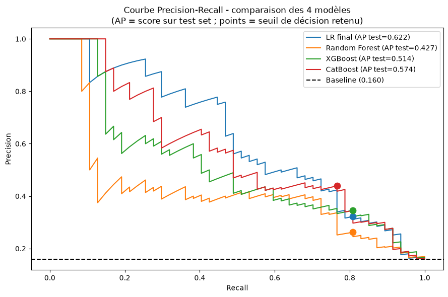

# Pipeline ML et choix techniques

## Pipeline en 5 étapes

```
CSV (3 sources)
    │
    ▼
1. CHARGEMENT     src/data/loader.py
   Jointure des 3 fichiers sur id_employee → 1 DataFrame (1470 lignes)
    │
    ▼
2. PREPROCESSING  src/data/preprocessing.py
   Correction des typos, conversion des booléens, suppression des colonnes inutiles
    │
    ▼
3. FEATURE ENGINEERING  src/features/build_features.py
   Création des ratios, suppression des variables redondantes, séparation X / y
    │
    ▼
4. ENCODAGE       src/features/encoding.py
   Label encoding binaire (genre), ordinal (fréquence déplacements), one-hot (poste, département, statut marital)
    │
    ▼
5. ENTRAÎNEMENT   src/models/train.py
   CatBoost avec scale_pos_weight, RandomizedSearchCV sur recall, sélection de features par importance
```

## Feature engineering

Trois ratios ont été créés pour capturer des dynamiques RH non directement observables :

| Feature | Formule | Interprétation |
|---------|---------|---------------|
| `ratio_revenu_experience` | `revenu_mensuel / annee_experience_totale` | Revenu rapporté à l'expérience qui capte le sentiment de sous-rémunération |
| `ratio_evolution` | `annees_dans_le_poste_actuel / annees_dans_l_entreprise` | Stabilité de poste : un ratio proche de 1 indique une stagnation |
| `ratio_relation_manager` | `annees_sous_responsable_actuel / annees_dans_l_entreprise` | Stabilité managériale :un ratio faible indique des changements fréquents |

**Cas limites :**

- `ratio_evolution` et `ratio_relation_manager` : imputés à **0** si `annees_dans_l_entreprise = 0` (employé nouvellement arrivé)
- `ratio_revenu_experience` : imputé par la **médiane** si `annee_experience_totale = 0` (le salaire ne peut pas être nul)

## Sélection de features

Une sélection a été opérée en deux étapes :

1. **Feature importance CatBoost** (intrinsèque) : features avec importance < 1% identifiées
2. **Permutation importance** (validation croisée) : croisement avec les features à contribution nulle ou négative sur le recall

## Comparaison des modèles

Trois modèles ont été testées en plus de Catboost : régression logistique, random forest, XGBoost.

!!! note "Pourquoi CatBoost ?"
    La consigne exigeait un modèle non-linéaire. CatBoost est le seul à ne pas présenter
    d'overfitting significatif (recall train =env. recall test), tout en égalant les meilleures
    performances sur le jeu de test.

## Gestion du déséquilibre de classes

Le dataset est déséquilibré : env.16% de départs.

CatBoost utilise `scale_pos_weight = n_négatifs / n_positifs` pour pénaliser davantage les faux négatifs.

## Métriques finales

Le modèle a été évalué au seuil de décision **0.535** (ajusté depuis le défaut 0.5 pour maximiser le recall) :

| Métrique | Valeur | Interprétation |
|----------|--------|---------------|
| **Recall** | **0.766** | Sur 47 départs réels, 36 sont détectés à l'avance |
| Précision | 0.439 | Sur 82 alertes émises, 36 sont de vrais départs |
| F1-score | 0.558 | Compromis recall / précision |
| Faux négatifs | 11 | Départs non détectés : coût métier le plus élevé |
| Faux positifs | 46 | Alertes inutiles : coût accepté |



*Les points sur chaque courbe indiquent le seuil de décision retenu pour chaque modèle. Le point CatBoost correspond au seuil 0.535.*

!!! warning "Pourquoi prioriser le recall ?"
    Dans ce contexte, rater un départ (faux négatif) est plus coûteux que signaler à tort
    un employé qui reste (faux positif).


